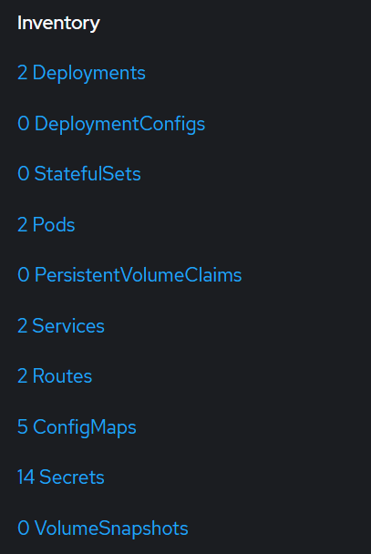

# Quick Guide: Deploying the Demo App to OpenShift with oc and Helm

---

## Prerequisites
- Access to an OpenShift cluster
- WSL installed and set up ([Microsoft guide](https://learn.microsoft.com/en-us/windows/wsl/install))
- `oc` CLI installed in WSL [BC Gov guide](https://developer.gov.bc.ca/docs/default/component/platform-developer-docs/docs/openshift-projects-and-access/install-the-oc-command-line-tool/)
- `helm` installed in WSL [Helm guide](https://helm.sh/docs/intro/install/)

### Installing Helm

Use the following commands to install helm in WSL
```sh
curl -fsSL -o get_helm.sh https://raw.githubusercontent.com/helm/helm/main/scripts/get-helm-3
chmod 700 get_helm.sh
./get_helm.sh
```

---

## 1. Clone Repo and cd in

```sh
git clone https://github.com/wburt/demo-app
cd demo-app
```

## 2. Log into oc

From [Install the oc command line tool](https://developer.gov.bc.ca/docs/default/component/platform-developer-docs/docs/openshift-projects-and-access/install-the-oc-command-line-tool/)

1. In order to login with the oc command line tool, first login to the [OpenShift Web Console](https://console.apps.silver.devops.gov.bc.ca/). IDIR is the preferred login method. For instructions, see the [Login to OpenShift Web Console page](https://developer.gov.bc.ca/docs/default/component/platform-developer-docs/docs/openshift-projects-and-access/login-to-openshift/)
2. Click on your name at the top-right corner of the screen, and choose: Copy login command
3. A new tab will open in your browser. You'll need to login again by clicking the button: **Developer Log In**
4. Next, you'll be directed to a page with a link to **Display Token**. Please do not share your tokens capture them on screen recordings as these grant access to OpenShift on your behalf. Click the link to reveal your tokens
5. Copy the entire line of text under: Log in with this token
6. Paste this command into your WSL terminal and run it. If successful, you should see an indication of which cluster you've logged in to, along with the number of projects you have access to and the project you are currently working in.

## 4. Activate the correct namespace
If you need to check what namespace you're in, us the command `oc project`. If you're not in `d4a7e0-dev`, then run `oc project d4a7e0-dev` to enter the correct namespace.

## 5. Deploying the application
Deploy the image by running the following command:
`helm install <your initials> charts`

If this works correctly, you will get a message similar to:
```sh
NAME: <your initials>
LAST DEPLOYED: Mon Jun  9 14:14:06 2025
NAMESPACE: d4a7e0-dev
STATUS: deployed
REVISION: 1
```

---
## Exploring your deployed application

Go over to the web gui [https://console.apps.silver.devops.gov.bc.ca](https://console.apps.silver.devops.gov.bc.ca) and explore to see your deployed application, its configuration, and how things are structured.

### Viewing your application
- From the top left, enter the `Developer` view, and then select `d4a7e0-dev` from the project immediately next to developer section
- On the `Topology` page, you will see a page with cards for each deployment. You can click on the link icon on the top right of your card to open the deployed application


Alternatively:\
From the WSL terminal, you can run `oc get routes` to list out all the routes in the namespace


### Viewing your deployed configuration
There are a number of different ways to view and explore things on Openshift.

- From the web: Select `Project` to view statistics and objects associated with the namespace.
- On the left (or bottom, depending on screen size), you will see an `Inventory` section. From there, you can see all the deployments, pods, services, routes, etc in the namespace.



- Open the `Deployment` link and find your deployment.
- You will be on a page where you can see the details for the deployment, change pod deployments, and see its configuration
- To view how the deployment is configured, select the YAML section.
- You can do this for most things in Openshift (deployments, pods, services, etc)


Alternatively:\
From the WSL terminal, you can run some of the following commands:
```sh
oc get all # Get all resources, with full addressing

# Get only resources of a single type:
oc get deployments
oc get pods
oc get services
oc get routes
oc get networkpolicies
```
To view the yaml for an item you can use this template:
```sh
oc get <deploy|pod|service|etc> <object> -o yaml
```

For example:\
`oc get deploy ic-demo-app -o yaml` or `oc get deployment.apps/ic-demo-app -o yaml`


---
## References
- [Helm Documentation](https://helm.sh/docs/)
- [OpenShift CLI Documentation](https://docs.openshift.com/container-platform/latest/cli_reference/openshift_cli/developer-cli-commands.html)